# Local Webhook Server with Cloudflare Tunnel

## Overview

Thêm tính năng Local Webhook Server cho phép người dùng nhận webhooks trực tiếp trên máy local thông qua Cloudflare Tunnel, đồng thời giữ nguyên tùy chọn sử dụng Remote AGNT webhooks.

### Architecture Comparison

```mermaid
flowchart TB
    subgraph Remote["🌐 Remote Mode (Current)"]
        A1[External Service] -->|POST| B1[api.agnt.gg]
        B1 --> C1[Queue]
        D1[Local AGNT] -->|Poll 10s| B1
        B1 -->|Triggers| D1
    end
    
    subgraph Local["🏠 Local Mode (New)"]
        A2[External Service] -->|POST| B2[Cloudflare Tunnel]
        B2 --> C2[Local AGNT :3333]
        C2 -->|Instant| D2[Trigger Workflow]
    end
```



| Feature | Remote Mode | Local Mode |
|---------|-------------|------------|
| Server | api.agnt.gg | localhost:3333 |
| Latency | ~10s polling | Instant |
| PRO License | Required | Not required |
| Internet | Always needed | Tunnel exposes local |
| URL Stability | Fixed | Quick=Random, Named=Fixed |

---

## Proposed Changes

### Backend

#### [NEW] CloudflareTunnelManager.js
Path: `backend/src/services/CloudflareTunnelManager.js`

```javascript
class CloudflareTunnelManager {
  // Check if cloudflared installed, auto-install via brew if missing
  async ensureInstalled()
  
  // Start quick tunnel (random URL, no account needed)
  async startQuickTunnel(port = 3333)
  
  // Start named tunnel (fixed URL, needs CF account + credentials)
  async startNamedTunnel(tunnelName, credentialsPath)
  
  // Get current tunnel URL
  getTunnelUrl(): string | null
  
  // Copy URL to clipboard automatically
  async copyUrlToClipboard()
  
  // Stop tunnel gracefully
  async stop()
  
  // Event emitter for tunnel status changes
  on('url-ready', callback)
  on('error', callback)
  on('stopped', callback)
}
```

---

#### [NEW] LocalWebhookRoutes.js
Path: `backend/src/routes/LocalWebhookRoutes.js`

```javascript
// Receive webhooks directly (no remote server)
POST   /api/local-webhook/:workflowId

// Tunnel management
GET    /api/local-webhook/tunnel/status
POST   /api/local-webhook/tunnel/start
POST   /api/local-webhook/tunnel/stop
GET    /api/local-webhook/tunnel/url
```

---

#### [MODIFY] server.js
Add import and route mounting:

```diff
+ import LocalWebhookRoutes from './src/routes/LocalWebhookRoutes.js';
+ app.use('/api/local-webhook', LocalWebhookRoutes);
```

---

### Frontend

#### [MODIFY] Webhooks.vue
Add mode selection UI:

- **Mode Toggle**: Remote (AGNT Server) ↔ Local (Cloudflare Tunnel)
- **Tunnel Type**: Quick Tunnel | Named Tunnel
- **Status Display**: Tunnel URL, connection status
- **Actions**: Start/Stop Tunnel, Copy URL, Configure Named Tunnel

---

### Configuration

#### [MODIFY] .env
```env
# Local Webhook Settings
LOCAL_WEBHOOK_ENABLED=true
LOCAL_WEBHOOK_PORT=3333

# Cloudflare Tunnel Settings
CF_TUNNEL_MODE=quick  # quick | named
CF_TUNNEL_NAME=my-agnt-tunnel
CF_TUNNEL_CREDENTIALS_PATH=~/.cloudflared/credentials.json
CF_TUNNEL_AUTO_START=true
CF_TUNNEL_AUTO_COPY_URL=true
```

---

## Installation Requirements

### Auto-install cloudflared (macOS)
```bash
# Script will check and install if missing
which cloudflared || brew install cloudflared
```

### Named Tunnel Setup (Optional)
```bash
# One-time setup for fixed URL
cloudflared tunnel login
cloudflared tunnel create my-agnt-tunnel
cloudflared tunnel route dns my-agnt-tunnel webhook.yourdomain.com
```

---

## Verification Plan

### Automated
```bash
# Test local webhook endpoint
curl -X POST http://localhost:3333/api/local-webhook/test-wf \
  -H "Content-Type: application/json" \
  -d '{"event": "test"}'
```

### Manual
1. Open AGNT → Connect → Webhooks
2. Select "Local Mode" 
3. Click "Start Tunnel" - verify URL appears
4. Copy URL, test from external service
5. Verify workflow triggers instantly
